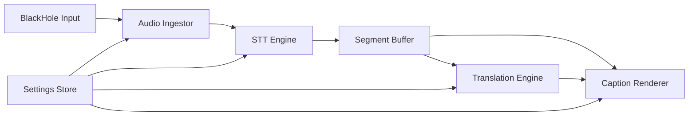

# 技術藍圖 Blueprint

## 系統實體命名 System Entities
| Entity | Description |
|---|---|
| Audio Source | BlackHole 或其他輸入裝置 |
| Audio Ingestor | 負責讀取 PCM frame |
| STT Engine | 將音訊轉為原文字幕 |
| Segment Buffer | 管理片段、時間戳、穩定度 |
| Translation Engine | 將原文片段翻譯成中文 |
| Caption Renderer | 顯示原文與譯文 |
| Settings Store | 保存 provider、語言與樣式設定 |

## 系統流程 System Flow

## 架構決策 Architecture Decisions
- 桌面應用建議:
  - UI: Electron + React [NEEDS_CONFIRMATION]
  - Audio / native layer: Node native module or Rust sidecar [NEEDS_CONFIRMATION]
- Provider 層需抽象化:
  - `TranscriptionProvider`
  - `TranslationProvider`
- 字幕資料模型需同時保留:
  - 原文
  - 譯文
  - 時間戳
  - 穩定度 / 是否 final

## 資料流 Data Flow
1. 使用者選擇 BlackHole 為輸入裝置
2. Audio Ingestor 以小批次讀取音訊
3. STT Engine 產出 partial/final transcript
4. Segment Buffer 將字幕切段與去抖動
5. Translation Engine 針對穩定片段產出中文
6. Caption Renderer 將雙字幕疊加顯示

## 關鍵技術議題 Key Technical Questions
- macOS 上哪種實作最穩定地讀取 BlackHole 輸入？
- STT 是否採本機 Whisper 類模型或雲端 API？
- 翻譯是否允許 partial translation，或只對 final transcript 翻譯？
