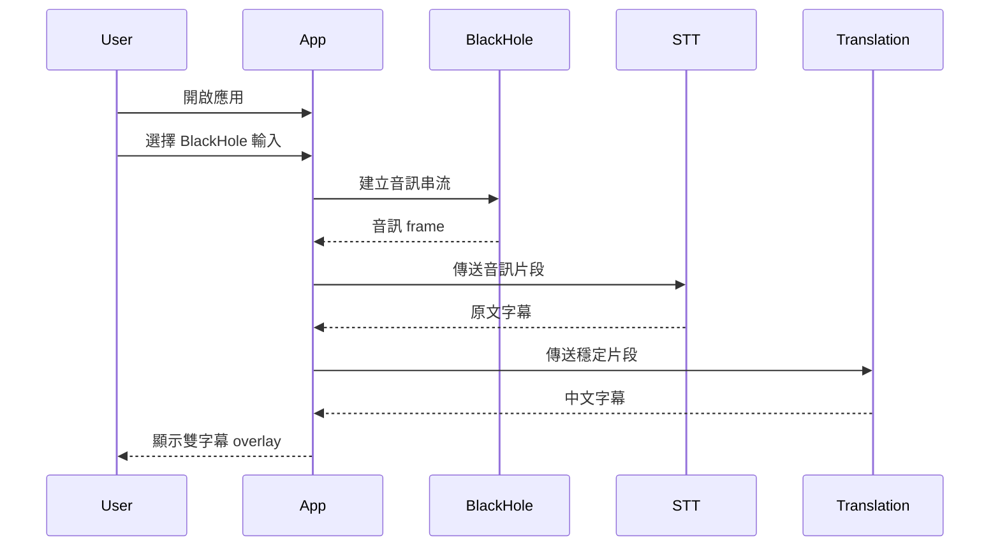

# 使用者旅程 User Journey Map

## 主要旅程 Main Journey

```mermaid
sequenceDiagram
    participant U as User
    participant A as App
    participant B as BlackHole
    participant S as STT
    participant T as Translation

    U->>A: 開啟應用
    U->>A: 選擇 BlackHole 輸入
    A->>B: 建立音訊串流
    B-->>A: 音訊 frame
    A->>S: 傳送音訊片段
    S-->>A: 原文字幕
    A->>T: 傳送穩定片段
    T-->>A: 中文字幕
    A-->>U: 顯示雙字幕 overlay
```

## 關鍵體驗節點 Key Moments
- 首次設定是否容易理解
- 字幕是否足夠快且穩定
- overlay 是否不遮擋主要會議內容
