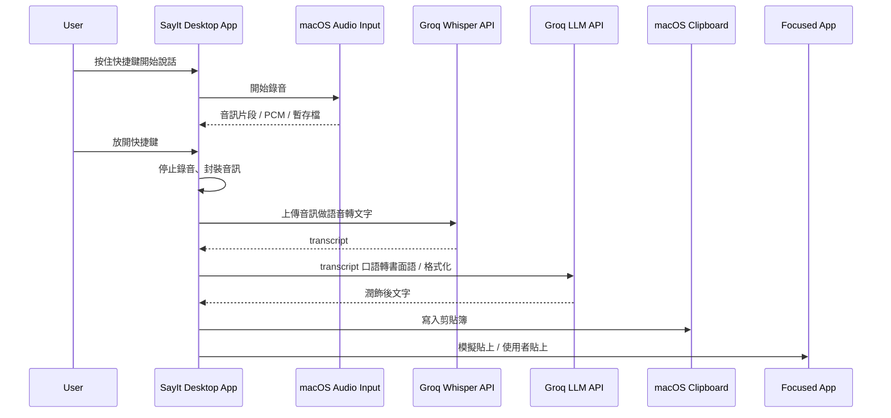
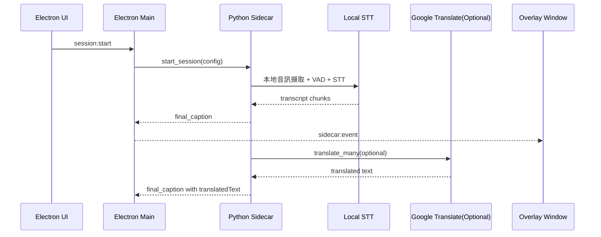
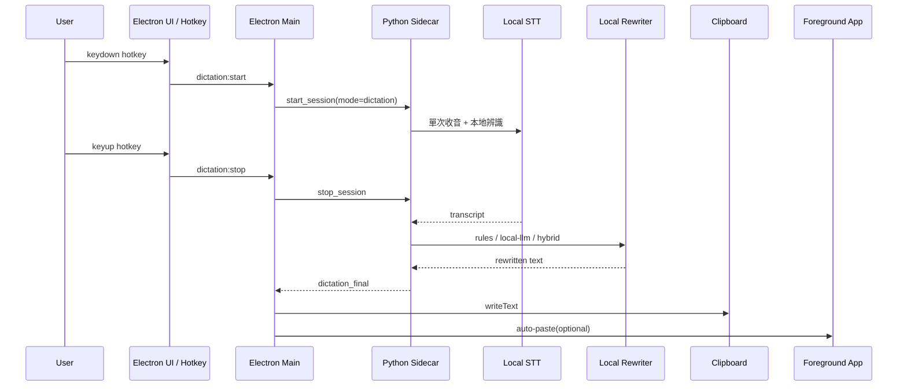

# SayIt 本地化整合規劃

## Summary

在現有 `realtime-bilingual-subtitles` 上擴充為雙模式產品：

- `subtitle`：保留現有即時雙語字幕流程。
- `dictation`：新增 SayIt 式「按住說話、放開完成、輸出文字」流程。
- 第一版採完全本地鏈路：`本地 STT + 本地文字修飾`，不接 Groq 或其他遠端 AI。
- `dictation` 第一版同時提供兩種輸出：`copy to clipboard` 與 `auto-paste to foreground app`。
- `dictation` 主觸發以可監聽 `keydown/keyup` 的 `native global hotkey listener` 為主；Electron `globalShortcut` 只作為單擊型 fallback、熱鍵驗證輔助、或除錯入口。
- 保留 app 內手動觸發作為 fallback 與除錯入口。

## Current-State Timing

### SayIt 現況

### 本專案現況

## Target Design

### Product Modes

- `subtitle mode`
  - 沿用現有 session、overlay、caption event 流程。
  - 仍可選擇是否開啟翻譯。
- `dictation mode`
  - 新增單次語音輸入流程，不顯示字幕 overlay。
  - 使用者按下快捷鍵開始收音，放開時 finalize。
  - finalize 後依序執行 STT、文字修飾、copy/paste。
  - 與 `subtitle mode` 採互斥模式，同一時間只能有一個 active session。

### Hotkey Architecture

- `press-to-talk / release-to-finalize` 不能只依賴 Electron `globalShortcut`，因其不提供 `keyup`。
- `dictation` 主路徑改為：
  - `native key listener` 監聽全域 `keydown/keyup`
  - main process 接收 key 狀態事件後控制 dictation start/stop
- 候選實作：
  - 原生 macOS helper（Swift / Objective-C）
  - 可行再評估的第三方 native listener 套件
- `globalShortcut` 僅保留在下列用途：
  - 單擊切換型 fallback
  - app 內測試 hotkey
  - 設定頁 accelerator 驗證輔助
- V1 需先確定 `native key listener` 方案，再進入 dictation 主流程實作。

### Target Timing

## Remote Services To Remove

- `Groq Whisper API`
  - 目前 SayIt 用於 STT，音訊會離開本機。
- `Groq LLM API`
  - 目前 SayIt 用於口語轉書面語，文字會離開本機。

本地化目標是讓 `audio -> transcript -> rewritten text -> output` 全部在本機完成。

## Implementation Changes

### Electron / UX

- 新增 `appMode: 'subtitle' | 'dictation'`。
- 設定頁新增 dictation 區塊：
  - `dictationHotkey`
  - `dictationOutputAction: 'copy' | 'paste' | 'copy-and-paste'`
  - `rewriteBackend: 'rules' | 'local-llm' | 'hybrid'`
  - `autoEnterAfterPaste`
- `dictation` 模式不顯示字幕 overlay，只顯示狀態提示或 toast。
- 預設 `dictationHotkey` 為 `Cmd+Shift+Space`。
- 若 `native hotkey listener` 初始化失敗或缺少所需權限，UI 顯示錯誤並退回 app 內按住說話按鈕；必要時再啟用單擊型 `globalShortcut` fallback。
- 自訂 hotkey 驗證規則：
  - 不允許只有單一修飾鍵。
  - 不允許空值。
  - 對常見系統快捷鍵與 app 內既有快捷鍵做 best-effort 衝突檢查。
  - 若存在高風險衝突，顯示明確 warning；是否拒絕保存由最終 hotkey backend 能力決定，不在規劃階段寫死。

### macOS Permissions / Paste Fallback

- `native key listener` 若使用 macOS 原生事件監聽，可能需要 `Input Monitoring` 權限。
- `auto-paste` 依賴 macOS Accessibility 權限。
- 權限模型需拆開處理：
  - `Input Monitoring`：全域 key down/up 監聽
  - `Accessibility`：模擬貼上、可能的前景 app 操作
- 首次開啟 `paste` 或 `copy-and-paste` 時，main process 先檢查 Accessibility 權限。
- 首次啟用 dictation global hotkey 時，main process 先檢查 hotkey 方案所需權限。
- 若未授權：
  - 顯示一次性引導，說明需到 `System Settings -> Privacy & Security -> Accessibility` 啟用 app。
  - 本次輸出自動降級為 `copy`，不得靜默失敗。
  - `dictation_final` 仍要完成並寫入 clipboard。
- 若未授權 `Input Monitoring`：
  - `global press-to-talk` 不啟用。
  - 自動退回 app 內按住說話按鈕，必要時退回單擊型 `globalShortcut` fallback。
- 權限狀態需提供手動重檢入口，不假設授權後一定要重啟 app。
- `auto-paste` 執行前必做焦點一致性檢查：
  - `keyup` 當下記錄前景 app / window。
  - paste 前再次比對。
  - 若焦點已變更，降級為 `copy` 並提示 `Focus changed, text copied to clipboard`。
- 若 paste 執行失敗：
  - 不重試多次。
  - 保留 clipboard 結果。
  - 顯示 `Paste failed, text copied to clipboard` 類型提示。

### Main Process

- 在 Electron main 新增：
  - `native hotkey listener` 啟動、更新、釋放
  - `globalShortcut` fallback 註冊、更新、釋放
  - `clipboard.writeText()` 輸出
  - macOS 前景 app auto-paste 封裝
  - dictation 焦點快照與 paste 前比對
- 新增 IPC：
  - `dictation:start`
  - `dictation:stop`
  - `dictation:status`
  - `dictation:test-hotkey`
  - `permissions:check-accessibility`
  - `permissions:check-input-monitoring`
- settings 變更時即時重註冊 hotkey，不要求重啟。
- `dictation` / `subtitle` 切換時，main process 需進入 `switching` 狀態：
  - 先送出 `stop_session`
  - 等 sidecar 明確回覆 stopped ack
  - 再啟動新 session
- 不允許並行存活，也不允許在 `switching` 期間重複觸發 start。

### Sidecar / Audio Pipeline

- 將 sidecar session 拆成兩種模式：
  - `subtitle session`
  - `dictation session`
- `dictation session` 採單次錄音、停止後一次 finalize，不走字幕導向的持續 caption event。
- sidecar 協定維持 `start_session` / `stop_session`，不額外膨脹 command；以 payload 中的 `mode` 區分行為。
- 所有 sidecar event 與 session command 都必帶：
  - `mode: 'subtitle' | 'dictation'`
  - `sessionId`
- 新增事件：
  - `dictation_state`
  - `dictation_final`
  - `session_stopped_ack`
- `subtitle` 事件與 `dictation` 事件不可共用同一份 renderer state，main process 需按 `mode` 分流。
- 文字修飾採雙層策略：
  - `rules`：deterministic 規則清理
  - `local-llm`：可插拔本地 LLM provider
  - `hybrid`：先 `rules` 再 `local-llm`
- 若 local LLM provider 不可用，回退 `rules` 並上報 warning。
- dictation V1 的 STT / rewrite 模型生命週期需明確定義：
  - `stop_session` 停止收音與 finalize，不等同於必然卸載模型
  - 模型是否常駐由 mode 與 idle policy 控制

### Local LLM Provider Selection

- V1 的 `local-llm` provider 介面固定為單次同步呼叫：`rewrite(text, locale, style) -> text`。
- V1 先以 provider abstraction 落地，不把實際模型綁死在主流程；實作階段從下列候選中擇一：
  - `MLX`：Apple Silicon 優先，安裝與部署較貼近本機 macOS 場景。
  - `Ollama`：整合門檻低，但模型管理與背景服務依賴較重。
  - `llama.cpp`：控制力高，但整合成本較高。
- 選型硬約束：
  - 模型大小以本機可接受範圍為主，預設目標小於 `4 GB`。
  - 首次推理延遲目標小於 `2 s`。
  - 10 秒語音對應的端到端輸出目標小於 `3 s`。
- 上述約束屬於實作選型目標，不代表任何指定 RAM 規格下保證達成；需以 benchmark 驗證。
- 若 `hybrid` 要作為預設，rewriter 需支援至少一次載入後常駐，或明確接受只有 warm path 達標。
- `local-llm` fallback 觸發條件：
  - provider 未安裝
  - 模型不存在
  - 呼叫 timeout
  - 執行期錯誤
- 任一 fallback 觸發時，自動退回 `rules`，並送出 recoverable warning event。

### Rewrite Rules Specification

- `rules` V1 範圍只處理保守清理，不做語意改寫：
  - 移除明顯語助詞與填充詞，如「呃」、「嗯」、「那個」
  - 合併重複詞與重複短語
  - 修正常見空白與標點
  - 中文輸出可選簡轉繁
  - 中英混排時保留英文大小寫與基本空白
- 語言策略：
  - 中文與中英混合：完整支援上述規則
  - 英文：只做填充詞、重複詞、標點與空白清理
  - 日文 / 韓文：僅做保守標點與空白清理，不做口語詞刪除
- 語言判斷來源：
  - 優先使用 STT 回傳的 `detected_lang`
  - 次選使用使用者設定的 `sourceLang`
  - 若兩者都無法可靠判定，退回最保守規則：只做標點與空白清理

### Error Handling & Edge Cases

- STT 回傳空字串：
  - 不執行 rewrite。
  - 不觸發 paste。
  - 顯示 `No speech detected` 類型提示。
- 過短語音：
  - 若錄音長度低於最小門檻，直接中止並顯示 `Speech too short`。
  - V1 先以 `300-500 ms` 為預設範圍，實作時定一個具體值並保留調參空間。
- dictation 執行中切換模式：
  - 先 stop 當前 session，等待 stopped ack，再切換 UI 狀態。
  - 不保留半成品 session。
- sidecar crash：
  - main process 顯示錯誤狀態。
  - 下次觸發時允許重新啟動 sidecar。
  - 不自動無限重連。
- global hotkey 按下後極短時間放開：
  - 視為無效輸入，不進行 STT。
- native hotkey listener 權限不足：
  - `dictation:start` 不由全域按鍵觸發。
  - app 內 fallback 仍可用。
- paste 目標焦點改變：
  - 不執行 paste。
  - 保留 clipboard 結果並顯示明確提示。

### Performance Budget

- `keydown hotkey -> start recording` 應為即時，熱路徑啟動延遲目標小於 `100 ms`。
- 熱路徑：
  - `keyup hotkey -> transcript ready` 目標小於 `1.5 s`，以 10 秒語音為基準。
  - `keyup hotkey -> final output copied` 目標小於 `2 s`。
  - 啟用 `hybrid` 時，`keyup hotkey -> final output pasted` 目標小於 `3 s`。
- 冷路徑：
  - 允許因模型首次載入超出上述預算，但需記錄 cold-start latency。
  - 若 cold path 明顯影響體驗，V1 應改採模型常駐或啟動時預熱。
- 若 `local-llm` 使端到端延遲持續超標，產品預設應回退 `rules`。

### Public Interfaces

- `AppMode = 'subtitle' | 'dictation'`
- `DictationOutputAction = 'copy' | 'paste' | 'copy-and-paste'`
- `RewriteBackend = 'rules' | 'local-llm' | 'hybrid'`
- `SessionMode = 'subtitle' | 'dictation'`
- `AppSettings` 新增：
  - `appMode`
  - `dictationHotkey`
  - `dictationOutputAction`
  - `rewriteBackend`
  - `autoEnterAfterPaste`
- `AppSettings` migration 規則需定義：
  - 舊版 settings 缺欄位時要安全補 default
  - 不因缺少 dictation 欄位造成 app crash
- `CaptionConfig` 擴充為通用 session config，至少加入：
  - `mode`
  - `sessionId`
  - dictation 相關欄位
- `SidecarEvent` 擴充為 mode-aware event union，所有 event 帶 `mode` 與 `sessionId`。

### Settings Defaults

- `appMode`: `subtitle`
- `dictationHotkey`: 待 native listener 格式確定前，UI 先沿用 `Cmd+Shift+Space` 表示預設組合
- `dictationOutputAction`: `copy-and-paste`
- `rewriteBackend`: `hybrid`
- `autoEnterAfterPaste`: `false`
- 若 native listener 方案最終不接受 Electron accelerator 格式，需在實作時補一次 settings migration

## Defaults

- 平台：macOS only
- 模式：雙模式一起做
- 本地化：完全本地，不接 Groq/OpenAI
- 輸出：同時支援 copy 與 auto-paste
- 觸發：全局快捷鍵優先，app 內按鈕為 fallback
- 修飾：預設 `hybrid`，但 local LLM 不可用時必須回退 `rules`

## Test Plan

### Unit Tests

- 規則式 rewrite：語助詞、重複詞、空白、標點、簡轉繁
- rewrite 語言判斷：`detected_lang`、`sourceLang`、unknown fallback
- settings load/save：新增 dictation 欄位的相容性
- settings migration：舊版設定檔缺少新欄位時可正常補 default
- `dictation_final` 與既有 `final_caption` 型別互不干擾
- event reducer / router：不同 `mode`、`sessionId` 不混線

### Integration Tests

- `subtitle` 模式仍能正常 start/stop 並產生 caption event
- `dictation` 模式能完成單次收音、STT、rewrite、copy/paste
- `copy`、`paste`、`copy-and-paste` 三種輸出行為正確
- hotkey 更新後能重註冊；失敗時 fallback 正常
- native hotkey listener 能正確傳遞 `keydown` / `keyup`
- native hotkey listener 權限不足時，會正確退回 fallback 路徑
- `hybrid` 在 local LLM 不可用時能退回 `rules`
- 切換 `subtitle` / `dictation` 時，不會殘留雙 session 或重複佔用麥克風
- `stop_session` 未 ack 前，不會啟動新 session
- 未授予 Accessibility 權限時，`paste` 會自動降級為 `copy`
- paste 前景 app 改變時，會自動降級為 `copy`
- STT 空結果、過短語音、sidecar crash 都有明確 recoverable 行為

### Manual Verification

- 在 Notes / TextEdit / ChatGPT Desktop 等前景 app 測試 paste
- 驗證焦點切換、快捷鍵誤觸、快速連續觸發
- 驗證 subtitle / dictation 模式切換後，overlay、session 狀態與 save log 不互相干擾
- 驗證熱路徑與冷路徑延遲是否符合預算或被正確記錄
- 驗證不同 macOS 版本下 native hotkey 權限、Accessibility 權限與 fallback 流程
