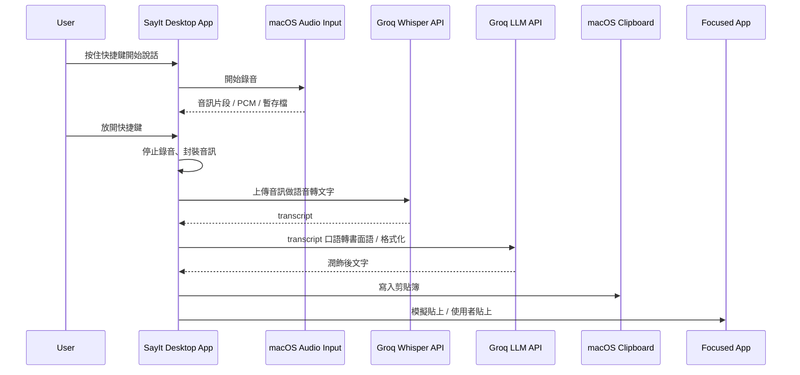
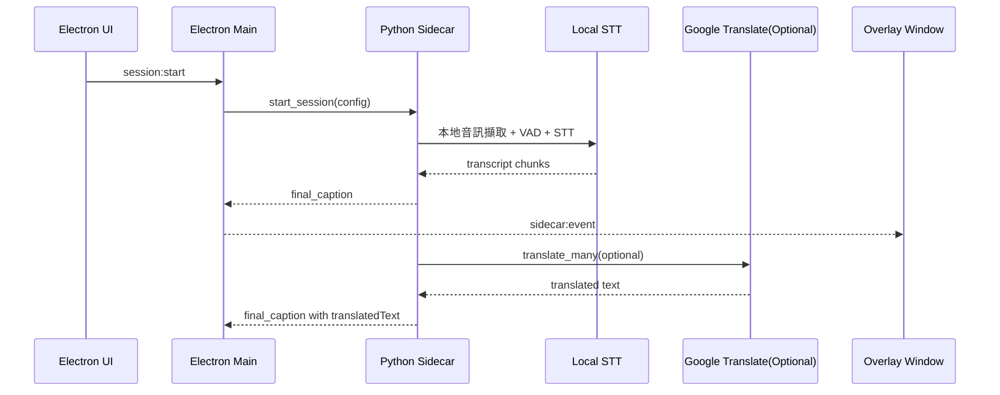
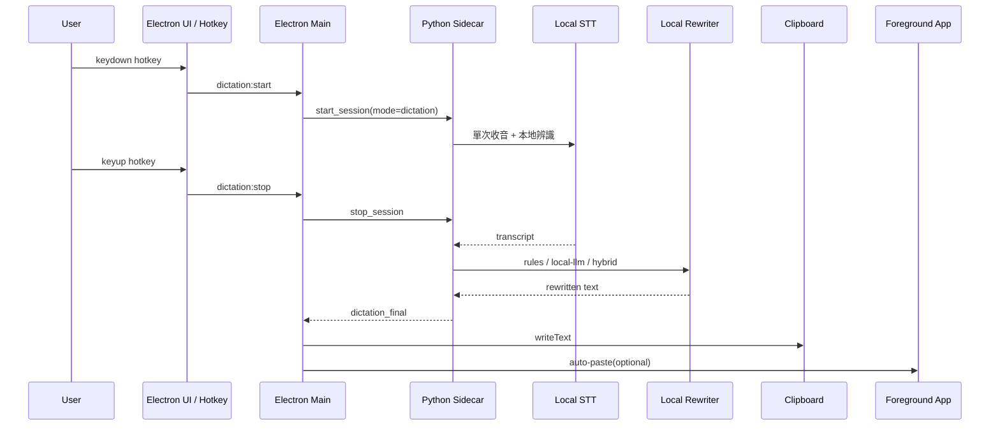

# SayIt 本地化整合規劃

## Summary

在現有 `realtime-bilingual-subtitles` 上擴充為雙模式產品：

- `subtitle`：保留現有即時雙語字幕流程。
- `dictation`：新增 SayIt 式「按住說話、放開完成、輸出文字」流程。
- 第一版採完全本地鏈路：`本地 STT + 本地文字修飾`，不接 Groq 或其他遠端 AI。
- `dictation` 第一版同時提供兩種輸出：`copy to clipboard` 與 `auto-paste to foreground app`。
- 觸發方式以 `global hotkey` 為主，保留 app 內手動觸發作為 fallback 與除錯入口。

## Current-State Timing

### SayIt 現況

### 本專案現況

## Target Design

### Product Modes

- `subtitle mode`
  - 沿用現有 session、overlay、caption event 流程。
  - 仍可選擇是否開啟翻譯。
- `dictation mode`
  - 新增單次語音輸入流程，不顯示字幕 overlay。
  - 使用者按下快捷鍵開始收音，放開時 finalize。
  - finalize 後依序執行 STT、文字修飾、copy/paste。

### Target Timing

## Remote Services To Remove

- `Groq Whisper API`
  - 目前 SayIt 用於 STT，音訊會離開本機。
- `Groq LLM API`
  - 目前 SayIt 用於口語轉書面語，文字會離開本機。

本地化目標是讓 `audio -> transcript -> rewritten text -> output` 全部在本機完成。

## Implementation Changes

### Electron / UX

- 新增 `appMode: 'subtitle' | 'dictation'`。
- 設定頁新增 dictation 區塊：
  - `dictationHotkey`
  - `dictationOutputAction: 'copy' | 'paste' | 'copy-and-paste'`
  - `rewriteBackend: 'rules' | 'local-llm' | 'hybrid'`
  - `autoEnterAfterPaste`
- `dictation` 模式不顯示字幕 overlay，只顯示狀態提示或 toast。
- 若 `globalShortcut` 註冊失敗，UI 顯示錯誤並退回 app 內按住說話按鈕。

### Main Process

- 在 Electron main 新增：
  - `globalShortcut` 註冊、更新、釋放
  - `clipboard.writeText()` 輸出
  - macOS 前景 app auto-paste 封裝
- 新增 IPC：
  - `dictation:start`
  - `dictation:stop`
  - `dictation:status`
  - `dictation:test-hotkey`
- settings 變更時即時重註冊 hotkey，不要求重啟。

### Sidecar / Audio Pipeline

- 將 sidecar session 拆成兩種模式：
  - `subtitle session`
  - `dictation session`
- `dictation session` 採單次錄音、停止後一次 finalize，不走字幕導向的持續 caption event。
- 新增事件：
  - `dictation_state`
  - `dictation_final`
- 文字修飾採雙層策略：
  - `rules`：deterministic 規則清理
  - `local-llm`：可插拔本地 LLM provider
  - `hybrid`：先 `rules` 再 `local-llm`
- 若 local LLM provider 不可用，回退 `rules` 並上報 warning。

### Public Interfaces

- `AppMode = 'subtitle' | 'dictation'`
- `DictationOutputAction = 'copy' | 'paste' | 'copy-and-paste'`
- `RewriteBackend = 'rules' | 'local-llm' | 'hybrid'`
- `AppSettings` 新增：
  - `appMode`
  - `dictationHotkey`
  - `dictationOutputAction`
  - `rewriteBackend`
  - `autoEnterAfterPaste`
- `CaptionConfig` 擴充為通用 session config，加入 `mode` 與 dictation 相關欄位。

## Defaults

- 平台：macOS only
- 模式：雙模式一起做
- 本地化：完全本地，不接 Groq/OpenAI
- 輸出：同時支援 copy 與 auto-paste
- 觸發：全局快捷鍵優先，app 內按鈕為 fallback
- 修飾：預設 `hybrid`，但 local LLM 不可用時必須回退 `rules`

## Test Plan

### Unit Tests

- 規則式 rewrite：語助詞、重複詞、空白、標點、簡轉繁
- settings load/save：新增 dictation 欄位的相容性
- `dictation_final` 與既有 `final_caption` 型別互不干擾

### Integration Tests

- `subtitle` 模式仍能正常 start/stop 並產生 caption event
- `dictation` 模式能完成單次收音、STT、rewrite、copy/paste
- `copy`、`paste`、`copy-and-paste` 三種輸出行為正確
- hotkey 更新後能重註冊；失敗時 fallback 正常
- `hybrid` 在 local LLM 不可用時能退回 `rules`

### Manual Verification

- 在 Notes / TextEdit / ChatGPT Desktop 等前景 app 測試 paste
- 驗證焦點切換、快捷鍵誤觸、快速連續觸發
- 驗證 subtitle / dictation 模式切換後，overlay、session 狀態與 save log 不互相干擾
