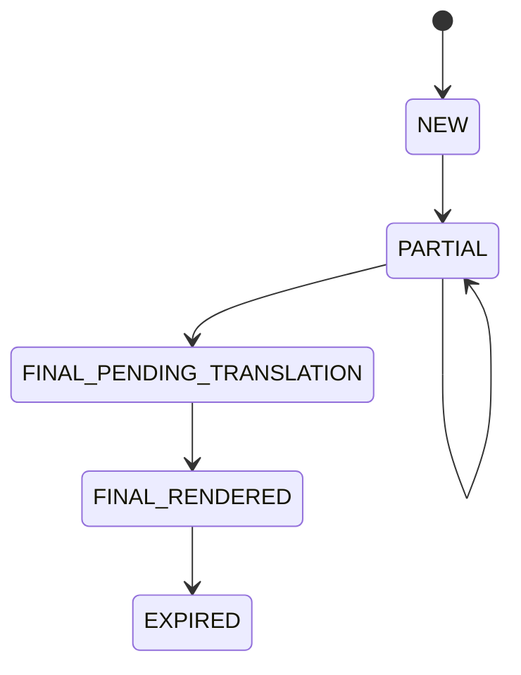

# 狀態機 State Machines

## Caption Segment 狀態機

| 當前狀態 | 觸發條件 | 下一狀態 | Guard 條件 | 失敗行為 |
|---|---|---|---|---|
| NEW | 收到 partial transcript | PARTIAL | 片段非空 | 丟棄 |
| PARTIAL | 收到更新 transcript | PARTIAL | 同 segment id | 覆蓋失敗則重建 |
| PARTIAL | 收到 final transcript | FINAL_PENDING_TRANSLATION | final flag = true | 維持 PARTIAL |
| FINAL_PENDING_TRANSLATION | 翻譯完成 | FINAL_RENDERED | 翻譯成功 | 顯示原文並標記翻譯失敗 |
| FINAL_RENDERED | 超過保留時間 | EXPIRED | TTL 到期 | 繼續保留 |

終態：`EXPIRED`

## Audio Session 狀態機

| 當前狀態 | 觸發條件 | 下一狀態 | Guard 條件 | 失敗行為 |
|---|---|---|---|---|
| IDLE | 使用者按下開始 | CONNECTING | 已選擇輸入裝置 | 提示未選擇裝置 |
| CONNECTING | 裝置開啟成功 | STREAMING | 權限正常 | 轉 ERROR |
| STREAMING | 裝置中斷 | ERROR | 無 | 顯示錯誤 |
| STREAMING | 使用者停止 | STOPPED | 無 | 維持 STREAMING |
| ERROR | 使用者重試 | CONNECTING | 裝置仍可用 | 提示修復建議 |

終態：`STOPPED`
